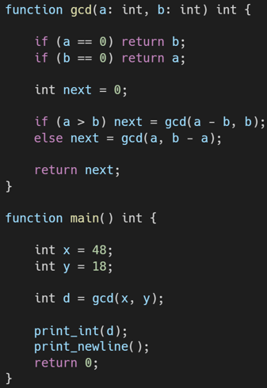
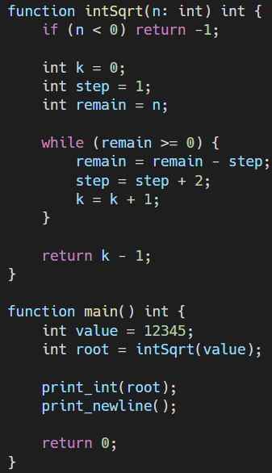
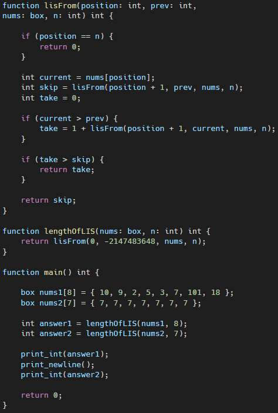

# **Yox47**

## **Description**

**Yox47** is a compact, statically‑typed, block‑structured programming language, written  in C++. It covers each stage of the toolchain — from tokenization and abstract syntax trees to semantic validation and optimized assembly emission. Yox47’s type system includes primitive types (`int`, `float`, `char`, `bool`), heap‑allocated `box[T]` arrays, and explicit function signatures. Control flow constructs comprise `if/else`, `for`, `while`, `break`, and `choose/case`.

---

## Supported Features

- **Types:**
  - `int`, `float`, `char`, `bool`
  - `box[T]` – heap-allocated arrays of type `T`

- **Functions:**
  - Explicit type declarations for parameters and return types
  - Support for return values
  - Nested function calls

- **Control Flow:**
  - `if`, `else`, `while`, `for`, `break`
  - `choose/case` – similar to `switch`, with multiple case options

- **Expressions:**
  - Arithmetic: `+`, `-`, `*`, `/`, `%`
  - Comparison: `==`, `!=`, `<`, `<=`, `>`, `>=`
  - Logical: `&&`, `||`, `!`
  - Assignment: `=`

- **Scoping & Blocks:**
  - Local variable scoping using `{}` blocks

- **Memory:**
  - Allocation via `box[T]`
  - No garbage collection — manual memory handling where required

- **Code Generation:**
  - Emits optimized assembly (`out.asm`)
  - Separation of runtime and compile-time code

- **Toolchain:**
  - Full compilation pipeline: lexer → parser → AST → semantic analysis → code generation

---

## Not Yet Supported / Known Limitations

- No support for:
  - Structs or object-oriented features
  - Inheritance or polymorphism
  - Generics beyond `box[T]`
  - Exception handling (`try/catch`)
  - Lambda/anonymous functions
  - Importing external modules/files
  - Input/output operations (e.g., user input, file writing)
  - Strings as a native, first-class type
  - Standard libraries

- Statically linked only - no dynamic linking
- No support for multithreading or concurrency primitives

---

## Compilation Pipeline Example (Internal Flow)

Yox47 follows a strict pipeline:

1. **Lexical Analysis** – `Lexer` tokenizes the source file.
2. **Parsing** – `Parser` builds the AST from tokens.
3. **Semantic Analysis** – Type checks and validates correctness.
4. **Code Generation** – Emits assembly into `out.asm`.

Example internal flow from `main.cpp`:

```cpp
Lexer lexer(source.c_str(), source.size());
Parser parser(lexer);
auto ast = parser.parseProgram();
SemanticChecker checker;
checker.check(ast.get());
CodeGenerator generator(ast.get(), "out.asm");
generator.generate();
```

---

## File Input Format

The compiler expects a `test.txt` file in the root with the source code. It reads the entire file into memory before processing.

---

## File Structure Summary

| Folder/File                        | Purpose                                      |
|------------------------------------|----------------------------------------------|
| `Lexer.*`                          | Tokenizes source code                        |
| `Parser.*`                         | Builds the AST                               |
| `Semantic.*`                       | Validates types and scopes                   |
| `CodeGenerator.*`                  | Emits assembly instructions                  |
| `ast_nodes/`                       | All AST node types                           |
| `runtime.asm`                      | Required runtime for generated assembly      |
| `out.asm`                          | Final output file                            |
| `build.bat`                        | Batch script for building (Windows)          |
| `test.txt`                         | Input source file for the compiler           |

---

## How to Build and Run

1. **Prepare Input**: Place your source code in `source/test.txt`
2. **Build and Run**:
   ```sh
   cd source
   ./build.bat  # or compile manually with NASM/FASM + linker
   ./a.exe      # if you compiled to an executable
   ```

---
   
## Syntax Overview

| Concept                   | Syntax Example                                      |
|---------------------------|------------------------------------------------------|
| **Variable declaration**  | `int x = 5;`                                         |
| **Function declaration**  | `function add(a: int, b: int) int { return a + b; }` |
| **Function return**       | `return x * 2;`                                      |
| **Array access**          | `int y = arr[2];`                                    |
| **Array assign**          | `arr[3] = 42;`                                       |
| **If/else**               | `if (x > 0) { ... } else { ... }`                   |
| **While loop**            | `while (x < 10) { x = x + 1; }`                     |
| **For loop**              | `for (int i = 0; i < 10; i = i + 1) { ... }`        |
| **Choose/case**           | `choose(x) { case 1: ...; case 2: ...; }`           |
| **Break statement**       | `break;`                                             |
| **Function call**         | `int y = add(3, 4);`                                |
| **Logical expression**    | `if (a > 0 && b < 5) { ... }`                       |
| **Arithmetic expression** | `int z = x * (y + 2);`                              |
| **Comparison**            | `if (a != b) { ... }`                               |
| **Assignment**            | `x = x + 1;`                                        |
| **Block scoping**         | `{ int temp = 3; ... }`                             |
| **Empty block**           | `{}`                                                |
| **Comment (single-line)** | `// this is a comment`                              |
| **Comment (multi-line)**  | `/* start ... end */`                               |

---

<div style="display: flex; gap: 100px; justify-content: center;">
    
    
    
</div>
